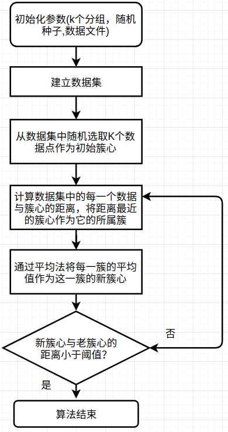
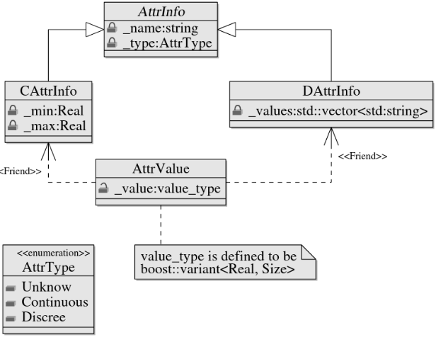
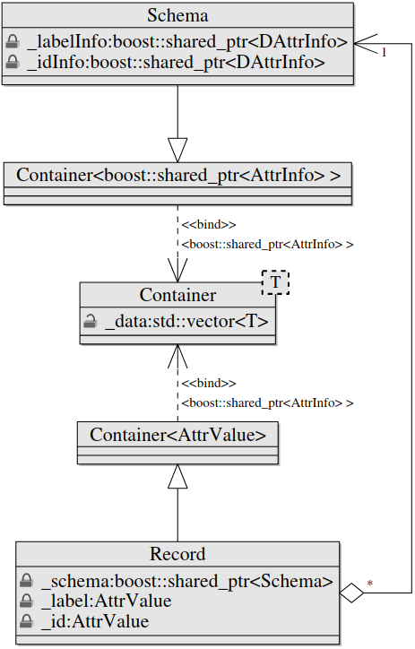

# 并行计算的K-Means聚类算法实现

## 一，实验介绍
聚类是拥有相同属性的对象或记录的集合，属于无监督学习，K-Means聚类算法是其中较为简单的聚类算法之一，具有易理解，运算深度块的特点。

### 1.1 实验内容
通过本次课程我们将使用C++语言实现一个完整的面向对象的可并行K-Means算法。这里我们一起围绕着算法需求实现各种类，最终打造出一个健壮的程序。所以为了更好地完成这个实验，需要你有C++语言基础，会安装一些常用库，喜欢或愿意学习面向对象的编程思维。
### 1.2 实验知识点
- C++语言语法
- K-Means算法思路与实现
- 并行计算思路与实现
- boost库的常用技巧(Smart Pointers,Variant，tokenizer)

### 1.3 实验环境
- Xfce 终端（Xfce Terminal）：
Linux 命令行终端，打开后会进入 Bash 环境，可以用来执行 Linux 命令和调用系统调用。
- GVim：非常好用的编辑器，不会使用的可以参考课程 《Vim编辑器》。
- boost,MPICH2库
### 1.4 适合人群
本课程适合有C++语言基础，对聚类算法感兴趣并希望在动手能力上得到提升的同学。
### 1.5 代码获取

### 1.6 效果图

输出结果文件

<div align=center>


图1 输出文件图

</div>


### 1.7 项目结构与框架
项目的整个文件目录:
```
├── clusters
│   ├── distance.hpp
│   └── record.hpp
├── datasets
│   ├── attrinfo.hpp
│   ├── dataset.hpp
│   └── dcattrinfo.hpp
├── mainalgorithm
│   ├── kmean.hpp
│   └── kmeanmain.cpp
└── utilities
    ├── datasetreader.hpp
    ├── exceptions.hpp
    ├── null.hpp
    └── types.hpp
```

这里简单介绍一下功能模块,在具体实践每一个类的时候会有详细UML图或流程图。

主要分为4个模块：数据集类,聚集类,实用工具类,算法类。

- 实用工具类:定义各种需要的数据类型;常用的异常处理；文件读取。

- 数据集类:将文件中的数据通过智能指针建立一个统一数据类，拥有丰富的属性和操作。

- 聚集类:在数据类基础上实现中心簇。

- 算法类:完成对聚集类的初始化，通过算法进行更新迭代，最终实现数据集的聚类并输出聚类结果。


## 二,实验原理
这一章我们将配置好我们的实验环境并介绍一些基础知识。
### 2.1 依赖库安装
安装boost和mpich2
```shell
mpich2下载:
wget -c http://www.mpich.org/static/downloads/3.2.1/mpich-3.2.1.tar.gz

解压:
tar xvfz mpich-3.2.1.tar.gz

配置:
cd mpich-3.2.1
./configure

编译:
make

安装:
make install 

boost下载:
wget -c https://dl.bintray.com/boostorg/release/1.68.0/source/boost_1_68_0.tar.gz 

解压
tar xvfz boost_1_68_0.tar.gz
cd boost_1_68_0

编译:
sh bootstrap.sh

修改project-config.jam 文件
第19行添加一句:using mpi;

安装:
./bjam --with-programoptions --with-mpi install
```
自此支持mpi的boost安装完毕！
### 2.2 boost的小技巧
#### Smart Pointers
>在Boost中，智能指针是存储指向动态分配对象的指针的对象。智能指针非常有用，因为它们确保正确销毁动态分配的对象，即使在异常情况下也是如此。事实上，智能指针被视为拥有指向的对象，因此负责在不再需要时删除对象。Boost智能指针库提供了六个智能指针类模板。表给出了这些类模板的描述。本实验中将大量使用智能指针。


| 类   |      描述      | 
|:----------:|:-------------:|
| scoped_ptr |  单个对象的简单唯一所有权,不可复制. |
| scoped_array |    数组的简单唯一所有权。不可复制   |  
| shared_ptr | 对象所有权在多个指针之间共享 |  
|shared_array|多个指针共享的数组所有权| 
|weak_ptr|shared_ptr拥有的对象的非拥有观察者| 
|intrusive_ptr|具有嵌入引用计数的对象的共享所有权。| 

表1 智能指针类型简介

#### Variant versus Any
>Boost Variant类模板是一个安全通用的联合容器，和std::vector不同储存单个类型的多个值，variant可以储存多个类型的单个值，本实验中将使用variant储存双精度和整数类型来表示不同类型的数据。

与variant一样，Boost any是另一个异构容器。虽然Boost anys有许多与Boost variant相同的功能。
根据Boost库文档，Boost variant比Boost any具有以下优势：

1，variant保证其内容的类型是用户指定的有限类型集之一。

2，variant提供对其内容的编译时检查访问。

3，variant通过提供有效的，基于堆栈的存储方案，可以避免动态分配的开销。

同样Boost any也有一些优势:

1,any几乎允许任何类型的内容。

2,很少使用模板元编程技术

3,,,,,,

#### Tokenizer
>Tokenizer提供了一种灵活而简单的方法通过分割符（如:" , ")将一个完整的string分隔开。

 字符串为：”A flexible,easy tokenizer“

 如果通过","分割,则结果为：

 [A flexible]  [ easy tokenizer>]

以" " 为分隔符:
分割结果为：

 [A] [flexible,] [easy] [tokenizer]

### 2.3 K-Means算法思路

<div align=center>



图2 Ｋ-Means算法流程图

</div>


## 三，实验步骤
接下来将具体实践各个类,会给出每一个类的声明并解释其成员函数和数据成员以及相关联类之间的继承关系和逻辑关系.涉及到重要的成员函数的实现会给出其定义代码,一些普通的成员函数的源码可以到下载的源文件中查看,里面也会有详细的注解.
### 3.1 数据集的构建
数据对于一个聚类算法来说非常重要,在这里我们将一个数据集描述为一个记录(record),一个记录由一些属性(Attribute)表征.因此自然而然将依次建立attributes,records,最后是数据集datasets.
<div align=center>



图3 数据类UML关系图

</div>

#### 3.1.1 AttrValue类

AttrValue类有一个私有变量,有两个友元函数,一个公有成员函数.
_value是一个variant类型变量,它可以存储一个双精度或无符号整形的数据,分类数据用无符号整形数据表示.
AttrValue类自身无法存储或获取数据.它的两个友元函数可以获取和修改数据_value.

```c++
//source:datasets.attrinfo.hpp
class AttrValue 
{
    public:
       friend class DAttrInfo;//友元函数可以访问_value
       friend class CAttrInfo;//友元函数可以访问_value
       typedef boost::variant<Real,Size> value_type;//可存储双精度和无符号整形数据
       AttrValue();
    private:
       value_type _value;
};

inline AttrValue::AttrValue(): _value(Null<Size>()) {
    }//构造函数,将_value初始化为Null<Size>(定义在utillities/null.hpp中)
```
#### 3.1.2 AttrInfo类
AttrInfo是一个基类,包括了许多虚函数和纯虚函数.这些函数都将在它的派生类中具体实现,基类中仅进行声明和简单定义.
```c++
//source:datasets.attrinfo.hpp
//三种数据类型:未知型,连续型(双精度),离散型(无符号整形)
enum AttrType 
{
    Unknow,
    Continuous,
    Discrete
};

class DAttrInfo;
class CAttrInfo;
class AttrInfo 
{
public:
  AttrInfo(const std::string &name,AttrType type);//每一栏的属性名(id,attr,label,...)和该属性的数据类型(离散或连续)
  virtual ~AttrInfo(){}//虚析构函数
  std::string &name();//返回标签
  AttrType type() const;//返回数据类型
  virtual Real distance(const AttrValue&,const AttrValue&) const = 0;

  virtual void set_d_val(AttrValue&, Size) const;//AttrValue赋值;适用于DAttrInfo
  virtual Size get_d_val(const AttrValue&) const;//获取_value
  virtual void set_c_val(AttrValue&, Real) const;//AttrValue赋值;适用于CAttrInfo
  virtual Real get_c_val(const AttrValue&) const;//获取_value
  virtual bool can_cast_to_d() const;//布尔值,对于DAttrInfo类来说其返回值为true,相反为false.在基类的声明中全部初始化为false.
  virtual bool can_cast_to_c() const;
  virtual DAttrInfo& cast_to_d();//返回DAttrInfo本身
  virtual bool is_unknown(const AttrValue&) const = 0;
  virtual void set_unknown(AttrValue&) const = 0;
private:
   std::string _name;
   AttrType _type;
};
```
#### 3.1.3 CAttrInfo类和DAttrInfo类
CAttrInfo主要是用来表示连续型数据的一些属性和方法.有两个数据成员:_min和_max.表示最小值和最大值属性,在初始化时都将设置为```Null<Size>``` .这两个属性将在归一化的时候用到.CAttrInfo将会继承AttrInfo的一些函数,并且重新定义.

```c++
//source:datasets/dcattrinfo.hpp
class CAttrInfo: public AttrInfo 
{
    public: 
      CAttrInfo(const std::string& name);//构造函数
      Real distance(const AttrValue&,const AttrValue&)const;//两个距离
      void set_c_val(AttrValue &, Real) const;
      void set_min(Real);//设置最小值
      void set_max(Real);//设置最大值
      Real get_min() const;//获取最小值
      Real get_max() const;//获取最大值
      Real get_c_val(const AttrValue&) const;
      bool is_unknown(const AttrValue&) const;
      bool can_cast_to_c() const;
      void set_unknown(AttrValue&) const;
    protected:
      Real _min;
      Real _max;
};
CAttrInfo::CAttrInfo(const std::string& name)
    : AttrInfo(name, Continuous) { 
        _min = Null<Real>();
        _max = Null<Real>();
    }

```
DAttrInfo类有一个私有变量_values,它是一个string类型的vector,用来存储一些离散的字符串.在DAttrInfo对象中所有的离散值都将由字符串转化为唯一的无符号整形.
```c++
class DAttrInfo: public  AttrInfo //继承AttrInfo
{
    public: 
        DAttrInfo(const std::string& name);//构造函数，传入属性字符串
        const std::string& int_to_str(Size i) const;
        Size num_values() const;//获取长度
        Size get_d_val(const AttrValue&) const; //接口定义
        void set_d_val(AttrValue& , Size)const;//接口定义
        Size add_value(const std::string&, 
                bool bAllowDuplicate = true);//将一组离散值加入到_values中,比如“X,X,Y,Z"，
                                                //则values=[X,Y,Z],对应的二进制数字为[0,0,1,2]
                                                //对于属性值，则可以重复，但对于id则具有唯一性，不能重复
        DAttrInfo& cast_to_d();
        Real distance(const AttrValue&, const AttrValue&) const; //比较两个离散型变量的距离   
        bool is_unknown(const AttrValue& av) const;//值有缺省  
        bool can_cast_to_d() const;                           
        void set_unknown(AttrValue&) const;
    protected:
        std::vector<std::string> _values;
};
```
add_value 是一个将字符串转化为无符号整形数据的重要函数,返回值为该字符所表示的整形,并将为出现的字符添加进_values.

| Record   |      Attribute      | AttrValue
|:----------:|:-------------:|:-------------:|
|1|"A"|0|
|2|"B"|1|
|3|"A"|0|
|4|"C"|2|
|5|"B"|1|

| Record   |      Attribute      
|:----------:|:-------------:|
|0|"A"
|1|"B"
|2|"C"

表2 DAttrInfo的一个具体实例


通过上面表格中我们可以看到一组字符类型的数据被存储为该字符串所在的inex,如果该字符串第一次出现则为上一个字符串的index+1.这样相同的字符串都被转化为唯一的无符号整形._value这个辅助变量可以帮助实现这一功能.

```c++
Size DAttrInfo::add_value(const std::string& s,
        bool bAllowDuplicate) {
        Size ind = Null<Size>();
        //如果该字符串已经出现,则返回该字符串在_values中的index
        for(Size i=0;i<_values.size();++i) {
            if(_values[i] == s) {
                ind = i;
                break;
            }
        }
//如果未出现,则返回_values的大小-1.
//同时对于不允许重复字符串的数据,如ID,当出现重复字符串时则会错误提示.
        if(ind == Null<Size>()) {
            _values.push_back(s);
            return _values.size()-1;
        } else {
            if(bAllowDuplicate) {
                return ind;
            } else {
                FAIL("value "<<s<<" already exists");
                return Null<Size>();
            }
        } 
    }
```


这里需要看一下distance这个函数的定义,它返回的是一个双精度类型数值.如果传入的两个数据类型为Unknow则返回为0.0,其中一个为Unknow则为1,对于两个双精度类型的数据返回其差值.
```c++
Real CAttrInfo::distance(const AttrValue& av1,const AttrValue& av2) const {
        if(is_unknown(av1) && is_unknown(av2)){
	    return 0.0;
	}
        if(is_unknown(av1) ^ is_unknown(av2)){
	    return 1.0;
        }
        return boost::get<Real>(av1._value) - 
               boost::get<Real>(av2._value);
    }
```
对于离散型数据,两个离散数据之间的距离定义也会不同,这里主要是考虑到离散型数据都转化为相差为1的整形,所以只要两个DAttrInfo的值不同则距离就为1.0,所以在含有离散型和连续型数据的混合数据中连续型数据要进行归一化处理以满足量纲统一.

```c++
Real DAttrInfo::distance(const AttrValue& av1, 
                             const AttrValue& av2) const { 
        if(is_unknown(av1) && is_unknown(av2)) { 
            return 0.0; //如果两个值都有缺省,则距离为0
        }
        if(is_unknown(av1) ^ is_unknown(av2)) { 
            return 1.0;//如果有一个值缺省,距离为1
        }
        if(boost::get<Size>(av1._value) == 
           boost::get<Size>(av2._value) ) {
            return 0.0;//如果两个值相等，则无差距
        } else {
            return 1.0;//否则为最大距离1
        } 
    }
```
#### 3.1.4 Container类

Container类是一个基类模板,有一个vector的数据成员_data.add函数可以将T类型的数据添加进入_data,同样erase可以删除数据.[]是一个操作符重载,返回索引i对应的数据.
```c++
template <typename T>
class Container//基类模板
{
    public:
       typedef typename std::vector<T>::iterator iterator;
       iterator begin();
       iterator end();
       void erase(const T& val);
       void add(const T&val);//将val添加到向量中
       Size size() const; //返回_data的长度
       T& operator[](Size i);//下标索引，建立Schema与data的关系
    protected:
        ~Container(){}
        std::vector<T>_data;
};
```
Record和Schema是继承Container类的两个重要的类,他们之间的关系如下:
<div align=center>



图4 Container关系图

</div>

Record继承带参数AttrValue的模板类Container,有四个私有数据成员_label,_data,id和_schema._data继承自父类.每一个Record类都有一个指向Schema类的共享指针,可以将类型为AttrValue的数据储存在_data中,同样每一个record都有一个label和id.
```c++
//source:clusters/record.hpp
class Record:public Container<AttrValue>
{
    public: 
      Record(const boost::shared_ptr<Schema>& schema);//构造函数
      const boost::shared_ptr<Schema>& schema() const;
      const AttrValue& labelValue() const;
      const AttrValue& idValue() const;
      AttrValue& labelValue();
      AttrValue& idValue();
      Size get_id() const;
      Size get_label() const;
    private: 
        boost::shared_ptr<Schema> _schema;//通过_schema创建记录
        AttrValue _label;
        AttrValue _id;
};

```
Schema类
```c++
class Record;
class Schema:public Container<boost::shared_ptr<AttrInfo> >
{
    public:
      virtual ~Schema(){}
      const boost::shared_ptr<DAttrInfo>& labelInfo() const;//标签信息，整形
      const boost::shared_ptr<DAttrInfo>& idInfo() const;//id信息，整形
      boost::shared_ptr<DAttrInfo>& idInfo();//可以修改成员变量,_labelInfo
      boost::shared_ptr<DAttrInfo>& labelInfo();//可以修改成员变量,_idInfo
      void set_label(const boost::shared_ptr<Record>& r,const std::string& val);
      //设置记录的label
      void set_id(boost::shared_ptr<Record>& r,const std::string& val);
      //设置记录的id
    protected:
      boost::shared_ptr<DAttrInfo> _labelInfo;
      boost::shared_ptr<DAttrInfo> _idInfo;
};
```
### 3.2 创建一个数据库实例
>前面关于如何构建dataset相关类已经花了很多时间,下面就让我们实际操作如何创建一个具体的dataset.
假设我们有这样的一组数据:

|ID|Attr1|Attr2|Attr3|Label|
|:---:|:---:|:---:|:---:|:---:|
|r1|1.2|A|-0.5|1
|r2|-2.1|B|1.5|2
|r3|1.5|A|-0.1|1

那么我们如何将以上数据用我们的dataset类来表示呢?


