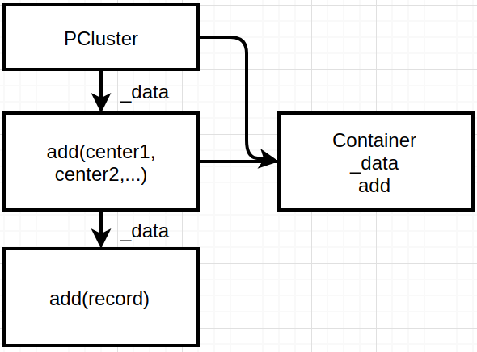

# 并行计算的K-Means聚类算法实现

## 一，实验介绍
聚类是拥有相同属性的对象或记录的集合，属于无监督学习，K-Means聚类算法是其中较为简单的聚类算法之一，具有易理解，运算深度块的特点.

### 1.1 实验内容
通过本次课程我们将使用C++语言实现一个完整的面向对象的可并行K-Means算法.这里我们一起围绕着算法需求实现各种类，最终打造出一个健壮的程序.所以为了更好地完成这个实验，需要你有C++语言基础，会安装一些常用库，喜欢或愿意学习面向对象的编程思维.
### 1.2 实验知识点
- C++语言语法
- K-Means算法思路与实现
- 并行计算思路与实现
- boost库的常用技巧(Smart Pointers,Variant，tokenizer)

### 1.3 实验环境
- Xfce 终端（Xfce Terminal）：
Linux 命令行终端，打开后会进入 Bash 环境，可以用来执行 Linux 命令和调用系统调用.
- GVim：非常好用的编辑器，不会使用的可以参考课程 《Vim编辑器》.
- boost,MPICH2库
### 1.4 适合人群
本课程适合有C++语言基础，对聚类算法感兴趣并希望在动手能力上得到提升的同学.
### 1.5 代码获取

### 1.6 效果图
完成时间显示:
- 单进程
```
completed in 31.9997 seconds
number of processes: 1
```
- 8进程
```
completed in 7.35373 seconds
number of processes: 8
```
输出结果文件

<div align=center>


图1 输出文件图

</div>


### 1.7 项目结构与框架
项目的整个文件目录:
```
├── clusters
│   ├── distance.hpp
│   └── record.hpp
├── datasets
│   ├── attrinfo.hpp
│   ├── dataset.hpp
│   └── dcattrinfo.hpp
├── mainalgorithm
│   ├── kmean.hpp
│   └── kmeanmain.cpp
└── utilities
    ├── datasetreader.hpp
    ├── exceptions.hpp
    ├── null.hpp
    └── types.hpp
```

这里简单介绍一下功能模块,在具体实践每一个类的时候会有详细UML图或流程图.

主要分为4个模块：数据集类,聚集类,实用工具类,算法类.

- 实用工具类:定义各种需要的数据类型;常用的异常处理；文件读取.

- 数据集类:将文件中的数据通过智能指针建立一个统一数据类，拥有丰富的属性和操作.

- 聚集类:在数据类基础上实现中心簇.

- 算法类:完成对聚集类的初始化，通过算法进行更新迭代，最终实现数据集的聚类并输出聚类结果.


## 二， 实验原理
这一章我们将配置好我们的实验环境并介绍一些基础知识.
### 2.1 依赖库安装
安装boost和mpich2
```shell
mpich2下载:
wget -c http://www.mpich.org/static/downloads/3.2.1/mpich-3.2.1.tar.gz

解压:
tar xvfz mpich-3.2.1.tar.gz

配置:
cd mpich-3.2.1
./configure

编译:
make

安装:
make install 

boost下载:
wget -c https://dl.bintray.com/boostorg/release/1.68.0/source/boost_1_68_0.tar.gz 

解压
tar xvfz boost_1_68_0.tar.gz
cd boost_1_68_0

编译:
sh bootstrap.sh

修改project-config.jam 文件
第19行添加一句:using mpi;

安装:
./bjam --with-programoptions --with-mpi install
```
检验boost是否安装成功,可以检测一下:
运行源码,test/mpitest.cpp
```
mpic++ -o mpitest mpitest.cpp -L/usr/local/lib -lboost_mpi -lboost_serialization 

mpirun -n 3 ./mpitest(3个进程)
```
若结果如下,有三个Process则证明安装成功!
```
Process 1: a msg from master

Process 2: a msg from master

Process 2:
Process 1:
Process 0: zero one two
Process 0: zero one two
Process 1: zero one two
Process 2: zero one two
```
### 2.2 boost的小技巧
#### Smart Pointers
>在Boost中，智能指针是存储指向动态分配对象的指针的对象.智能指针非常有用，因为它们确保正确销毁动态分配的对象，即使在异常情况下也是如此.事实上，智能指针被视为拥有指向的对象，因此负责在不再需要时删除对象.Boost智能指针库提供了六个智能指针类模板.表给出了这些类模板的描述.本实验中将大量使用智能指针.


| 类   |      描述      | 
|:----------:|:-------------:|
| scoped_ptr |  单个对象的简单唯一所有权,不可复制. |
| scoped_array |    数组的简单唯一所有权.不可复制   |  
| shared_ptr | 对象所有权在多个指针之间共享 |  
|shared_array|多个指针共享的数组所有权| 
|weak_ptr|shared_ptr拥有的对象的非拥有观察者| 
|intrusive_ptr|具有嵌入引用计数的对象的共享所有权.| 

表1 智能指针类型简介

#### Variant versus Any
>Boost Variant类模板是一个安全通用的联合容器，和std::vector不同储存单个类型的多个值，variant可以储存多个类型的单个值，本实验中将使用variant储存双精度和整数类型来表示不同类型的数据.

与variant一样，Boost any是另一个异构容器.虽然Boost anys有许多与Boost variant相同的功能.
根据Boost库文档，Boost variant比Boost any具有以下优势：

1，variant保证其内容的类型是用户指定的有限类型集之一.

2，variant提供对其内容的编译时检查访问.

3，variant通过提供有效的，基于堆栈的存储方案，可以避免动态分配的开销.

同样Boost any也有一些优势:

1,any几乎允许任何类型的内容.

2,很少使用模板元编程技术.

3,any 对交换操作提供安全的不抛出异常保证.
#### Tokenizer
>Tokenizer提供了一种灵活而简单的方法通过分割符（如:" , ")将一个完整的string分隔开.

 字符串为：”A flexible,easy tokenizer“

 如果通过","分割,则结果为：

 [A flexible]  [ easy tokenizer>]

以" " 为分隔符:
分割结果为：

 [A] [flexible,] [easy] [tokenizer]


## 三，实验步骤
接下来将具体实践各个类,会给出每一个类的声明并解释其成员函数和数据成员以及相关联类之间的继承关系和逻辑关系.涉及到重要的成员函数的实现会给出其定义代码,一些普通的成员函数的源码可以到下载的源文件中查看,里面也会有详细的注解.
### 3.1 数据集的构建
数据对于一个聚类算法来说非常重要,在这里我们将一个数据集描述为一个记录(record),一个记录由一些属性(Attribute)表征.因此自然而然将依次建立attributes,records,最后是数据集datasets.

在此之前我们需要了解一下我们在聚类中实际接触到的数据类型.
这里有一个示例,[心脏数据集](http://archive.ics.uci.edu/ml/machine-learning-databases/statlog/heart/).

```
//heart.data
70.0,1.0,4.0,130.0,322.0,0.0,2.0,109.0,0.0,2.4,2.0,3.0,3.0,2
67.0,0.0,3.0,115.0,564.0,0.0,2.0,160.0,0.0,1.6,2.0,0.0,7.0,1
57.0,1.0,2.0,124.0,261.0,0.0,0.0,141.0,0.0,0.3,1.0,0.0,7.0,2
64.0,1.0,4.0,128.0,263.0,0.0,0.0,105.0,1.0,0.2,2.0,1.0,7.0,1
74.0,0.0,2.0,120.0,269.0,0.0,2.0,121.0,1.0,0.2,1.0,1.0,3.0,1
65.0,1.0,4.0,120.0,177.0,0.0,0.0,140.0,0.0,0.4,1.0,0.0,7.0,1
......
```
包含13个属性,age,sex,chest pain type(4 values),resting blood pressure......
为了更好地表述不同数据相同属性的差异,我们需要对这些数据进行离散/连续处理,即对于有些数据我们认为它是连续的如:age,有些是离散的如:年龄.这样我们建立一个描述数据类型的文件:
```
//heart.names
schema file for heart.dat
///: schema
1, Continuous
2, Discrete
3, Discrete
4, Continuous
5, Continuous
6, Discrete
7, Discrete
8, Continuous
9, Discrete
10, Continuous
11, Discrete
12, Continuous
13, Discrete
14, Class
```


#### 3.1.1 AttrValue类

AttrValue类有一个私有变量,有两个友元函数,一个公有成员函数.
_value是一个variant类型变量,它可以存储一个双精度或无符号整形的数据,分类数据用无符号整形数据表示.
AttrValue类自身无法存储或获取数据.它的两个友元函数可以获取和修改数据_value.
<div align=center>


图2 数据类UML关系图

</div>

```c++ {class=line-numbers}
//source:datasets.attrinfo.hpp
class AttrValue 
{
    public:
       friend class DAttrInfo;//友元函数可以访问_value
       friend class CAttrInfo;//友元函数可以访问_value
       typedef boost::variant<Real,Size> value_type;//可存储双精度和无符号整形数据
       AttrValue();
    private:
       value_type _value;
};

inline AttrValue::AttrValue(): _value(Null<Size>()) {
    }//构造函数,将_value初始化为Null<Size>(定义在utillities/null.hpp中)
```
#### 3.1.2 AttrInfo类
AttrInfo是一个基类,包括了许多虚函数和纯虚函数.这些函数都将在它的派生类中具体实现,基类中仅进行声明和简单定义.
```c++ {class=line-numbers}
//source:datasets.attrinfo.hpp
//三种数据类型:未知型,连续型(双精度),离散型(无符号整形)
enum AttrType 
{
    Unknow,
    Continuous,
    Discrete
};

class DAttrInfo;
class CAttrInfo;
class AttrInfo 
{
public:
  AttrInfo(const std::string &name,AttrType type);//每一栏的属性名(id,attr,label,...)和该属性的数据类型(离散或连续)
  virtual ~AttrInfo(){}//虚析构函数
  std::string &name();//返回标签
  AttrType type() const;//返回数据类型
  virtual Real distance(const AttrValue&,const AttrValue&) const = 0;

  virtual void set_d_val(AttrValue&, Size) const;//AttrValue赋值;适用于DAttrInfo
  virtual Size get_d_val(const AttrValue&) const;//获取_value
  virtual void set_c_val(AttrValue&, Real) const;//AttrValue赋值;适用于CAttrInfo
  virtual Real get_c_val(const AttrValue&) const;//获取_value
  virtual bool can_cast_to_d() const;//布尔值,对于DAttrInfo类来说其返回值为true,相反为false.在基类的声明中全部初始化为false.
  virtual bool can_cast_to_c() const;
  virtual DAttrInfo& cast_to_d();//返回DAttrInfo本身
  virtual bool is_unknown(const AttrValue&) const = 0;
  virtual void set_unknown(AttrValue&) const = 0;
private:
   std::string _name;
   AttrType _type;
};
```
#### 3.1.3 CAttrInfo类和DAttrInfo类
CAttrInfo主要是用来表示连续型数据的一些属性和方法.有两个数据成员:_min和_max.表示最小值和最大值属性,在初始化时都将设置为```Null<Size>``` .这两个属性将在归一化的时候用到.CAttrInfo将会继承AttrInfo的一些函数,并且重新定义.

```c++ {class=line-numbers}
//source:datasets/dcattrinfo.hpp
class CAttrInfo: public AttrInfo 
{
    public: 
      CAttrInfo(const std::string& name);//构造函数
      Real distance(const AttrValue&,const AttrValue&)const;//两个距离
      void set_c_val(AttrValue &, Real) const;
      void set_min(Real);//设置最小值
      void set_max(Real);//设置最大值
      Real get_min() const;//获取最小值
      Real get_max() const;//获取最大值
      Real get_c_val(const AttrValue&) const;
      bool is_unknown(const AttrValue&) const;
      bool can_cast_to_c() const;
      void set_unknown(AttrValue&) const;
    protected:
      Real _min;
      Real _max;
};
CAttrInfo::CAttrInfo(const std::string& name)
    : AttrInfo(name, Continuous) { 
        _min = Null<Real>();
        _max = Null<Real>();
    }
```
DAttrInfo类有一个私有变量_values,它是一个string类型的vector,用来存储一些离散的字符串.在DAttrInfo对象中所有的离散值都将由字符串转化为唯一的无符号整形.
```c++ {class=line-numbers}
//source:datasets/dcattrinfo.hpp
class DAttrInfo: public  AttrInfo //继承AttrInfo
{
    public: 
        DAttrInfo(const std::string& name);//构造函数，传入属性字符串
        const std::string& int_to_str(Size i) const;
        Size num_values() const;//获取长度
        Size get_d_val(const AttrValue&) const; //接口定义
        void set_d_val(AttrValue& , Size)const;//接口定义
        Size add_value(const std::string&, 
                bool bAllowDuplicate = true);//将一组离散值加入到_values中,比如“X,X,Y,Z"，
                                                //则values=[X,Y,Z],对应的二进制数字为[0,0,1,2]
                                                //对于属性值，则可以重复，但对于id则具有唯一性，不能重复
        DAttrInfo& cast_to_d();
        Real distance(const AttrValue&, const AttrValue&) const; //比较两个离散型变量的距离   
        bool is_unknown(const AttrValue& av) const;//值有缺省  
        bool can_cast_to_d() const;                           
        void set_unknown(AttrValue&) const;
    protected:
        std::vector<std::string> _values;
};
```
add_value 是一个将字符串转化为无符号整形数据的重要函数,返回值为该字符所表示的整形,并将为出现的字符添加进_values.

| Record   |      Attribute      | AttrValue
|:----------:|:-------------:|:-------------:|
|1|"A"|0|
|2|"B"|1|
|3|"A"|0|
|4|"C"|2|
|5|"B"|1|

| Record   |      Attribute      
|:----------:|:-------------:|
|0|"A"
|1|"B"
|2|"C"

表2 DAttrInfo的一个具体实例


通过上面表格中我们可以看到一组字符类型的数据被存储为该字符串所在的inex,如果该字符串第一次出现则为上一个字符串的index+1.这样相同的字符串都被转化为唯一的无符号整形._value这个辅助变量可以帮助实现这一功能.

```c++ {class=line-numbers}
//source:datasets/dcattrinfo.hpp
Size DAttrInfo::add_value(const std::string& s,
        bool bAllowDuplicate) {
        Size ind = Null<Size>();
        //如果该字符串已经出现,则返回该字符串在_values中的index
        for(Size i=0;i<_values.size();++i) {
            if(_values[i] == s) {
                ind = i;
                break;
            }
        }
//如果未出现,则返回_values的大小-1.
//同时对于不允许重复字符串的数据,如ID,当出现重复字符串时则会错误提示.
        if(ind == Null<Size>()) {
            _values.push_back(s);
            return _values.size()-1;
        } else {
            if(bAllowDuplicate) {
                return ind;
            } else {
                FAIL("value "<<s<<" already exists");
                return Null<Size>();
            }
        } 
    }
```


这里需要看一下distance这个函数的定义,它返回的是一个双精度类型数值.如果传入的两个数据类型为Unknow则返回为0.0,其中一个为Unknow则为1,对于两个双精度类型的数据返回其差值.
```c++ {class=line-numbers}
//source:datasets/dcattrinfo.hpp
Real CAttrInfo::distance(const AttrValue& av1,const AttrValue& av2) const {
        if(is_unknown(av1) && is_unknown(av2)){
	    return 0.0;
	}
        if(is_unknown(av1) ^ is_unknown(av2)){
	    return 1.0;
        }
        return boost::get<Real>(av1._value) - 
               boost::get<Real>(av2._value);
    }
```
对于离散型数据,两个离散数据之间的距离定义也会不同,这里主要是考虑到离散型数据都转化为相差为1的整形,所以只要两个DAttrInfo的值不同则距离就为1.0,所以在含有离散型和连续型数据的混合数据中连续型数据要进行归一化处理以满足量纲统一.

```c++ {class=line-numbers}
//source:datasets/dcattrinfo.hpp
Real DAttrInfo::distance(const AttrValue& av1, 
                             const AttrValue& av2) const { 
        if(is_unknown(av1) && is_unknown(av2)) { 
            return 0.0; //如果两个值都有缺省,则距离为0
        }
        if(is_unknown(av1) ^ is_unknown(av2)) { 
            return 1.0;//如果有一个值缺省,距离为1
        }
        if(boost::get<Size>(av1._value) == 
           boost::get<Size>(av2._value) ) {
            return 0.0;//如果两个值相等，则无差距
        } else {
            return 1.0;//否则为最大距离1
        } 
    }
```
#### 3.1.4 Container类

Container类是一个基类模板,有一个vector的数据成员_data.add函数可以将T类型的数据添加进入_data,同样erase可以删除数据.[]是一个操作符重载,返回索引i对应的数据.
```c++ {class=line-numbers}
//source:clusters/record.hpp
template <typename T>
class Container//基类模板
{
    public:
       typedef typename std::vector<T>::iterator iterator;
       iterator begin();
       iterator end();
       void erase(const T& val);
       void add(const T&val);//将val添加到向量中
       Size size() const; //返回_data的长度
       T& operator[](Size i);//下标索引，建立Schema与data的关系
    protected:
        ~Container(){}
        std::vector<T>_data;
};
```
Record和Schema是继承Container类的两个重要的类,他们之间的关系如下:
<div align=center>


图3 Container关系图

</div>


#### 3.1.5 Schema类
Schema有两个保护数据成员_labelInfo,_idInfo.和一个继承父类的成员_data,_data是一个元素为AttrInfo的vector,表示每一个数据的属性(离散/连续)._labelInfo是一个指向DattrInfo的共享指针,其包含了输入数据的分类情况.
Schema的目的是为一个Record对象设置label和id.set_id和set_label函数是为了实现此功能,但是他们又依赖与Record所以我们在Record类中具体定义.

```c++ {class=line-numbers}
//source:clusters/record.hpp
class Record;
class Schema:public Container<boost::shared_ptr<AttrInfo> >
{
    public:
      const boost::shared_ptr<DAttrInfo>& labelInfo() const;//标签信息，整形
      const boost::shared_ptr<DAttrInfo>& idInfo() const;//id信息，整形
      boost::shared_ptr<DAttrInfo>& idInfo();//可以修改成员变量,_labelInfo
      boost::shared_ptr<DAttrInfo>& labelInfo();//可以修改成员变量,_idInfo
      void set_label(const boost::shared_ptr<Record>& r,const std::string& val);
      //设置记录的label
      void set_id(boost::shared_ptr<Record>& r,const std::string& val);
      //设置记录的id
    protected:
      boost::shared_ptr<DAttrInfo> _labelInfo;
      boost::shared_ptr<DAttrInfo> _idInfo;
};
```
#### 3.1.6 Record类

Record继承带参数AttrValue的模板类Container,有四个私有数据成员_label,_data,id和_schema._data继承自父类.每一个Record类都有一个指向Schema类的共享指针,可以将类型为AttrValue的数据储存在_data中,同样每一个record都有一个label和id.Record的构造函数需要传入一个指向Schema的共享指针,并将_data的长度设置为与_schema一样,将_data里的值设置为默认值.我们就可以通过Schema来操控Record,因为Schema的_data类型为AttrInfo有很多函数如add,set_c_val,add_value等函数可以对离散/类型数据进行操作.所以Record和Schema的关系为通过Schema定义了每一条数据的规范(label,id,每一条属性的类型),然后按照这个规范将数据填充到record中,因为record直接接触的类型是AttrValue.

```c++ {class=line-numbers}
//source:clusters/record.hpp
class Record:public Container<AttrValue>
{
    public: 
      Record(const boost::shared_ptr<Schema>& schema);//构造函数
      const boost::shared_ptr<Schema>& schema() const;
      const AttrValue& labelValue() const;
      const AttrValue& idValue() const;
      AttrValue& labelValue();
      AttrValue& idValue();
      Size get_id() const;
      Size get_label() const;
    private: 
        boost::shared_ptr<Schema> _schema;//通过_schema创建记录
        AttrValue _label;
        AttrValue _id;
};
```
#### 3.1.7 dataset类
上面已经实现了一条数据的储存就是一个Record,我们最终需要n条数据.这里新定义一个类Dataset.很明显按照上面的思路,Record依赖Schema,则Dataset依赖Record.
所以Dataset类继承类型为Record的Container.因为最后我们使用的的Dataset类,我们一些我们需要用到的属性可以在这里直接给出.num_attr(),返回属性的个数,is_numeric()判断该列属性值是否是连续行(对于Kmeans算法这里需要连续型数据),为了更加方便第获取每一个数据,使用操作符重载.
```c++ {class=line-numbers}
//source:datasets/dataset.hpp
inline const AttrValue& Dataset::operator()(Size i, Size j) const {
        return (*_data[i])[j];
}
```

```c++ {class=line-numbers} {class=line-numbers}
//source:datasets/dataset.hpp
class Dataset:public Container<boost::shared_ptr<Record> >
{
    public:
      Dataset(const boost::shared_ptr<Schema>&);//构造函数，传入含有属性值的schema
      Size num_attr() const;//返回属性个数
      const boost::shared_ptr<Schema> &schema() const;//返回_schrma
      const AttrValue& operator()(Size i, Size j) const;//返回第i条第j个属性的值
      std::vector<Size> get_CM() const; 
      bool is_numeric() const;
      bool is_categorical() const;
    protected:
      boost::shared_ptr<Schema> _schema;
};
```


### 3.2 创建一个数据实例
>前面关于如何构建dataset相关类已经花了很多时间,下面就让我们实际操作如何创建一个具体的dataset.

假设我们有这样的一组数据:

|ID|Attr1|Attr2|Attr3|Label|
|:---:|:---:|:---:|:---:|:---:|
|r1|1.2|A|-0.5|1
|r2|-2.1|B|1.5|2
|r3|1.5|A|-0.1|1

表3 数据实例

那么我们如何将以上数据用我们的dataset类来表示呢?

```c++ {class=line-numbers}
//test/datasettest.cpp
#include"../clusters/record.hpp"
#include "../datasets/dataset.hpp"
#include<iostream>
#include<sstream>
#include<iomanip>
using namespace std;
int main()
{
    boost::shared_ptr<Schema> schema(new Schema);
    boost::shared_ptr<DAttrInfo> labelInfo(new DAttrInfo("Label"));
    boost::shared_ptr<DAttrInfo>idInfo(new DAttrInfo("id"));
    schema->labelInfo() = labelInfo;
    schema->idInfo() = idInfo;
    
    stringstream ss;
    boost::shared_ptr<AttrInfo> ai;
    for(Size j=0;j<3;++j)
    {
        ss.str("");
        ss<<"Attr"<<j+1;
        if(j==0||j==2)
        {
            ai = boost::shared_ptr<CAttrInfo>(new CAttrInfo(ss.str()));
        }
        else{
            ai = boost::shared_ptr<DAttrInfo>(new DAttrInfo(ss.str()));
        }
        schema->add(ai);
    }
    boost::shared_ptr<Dataset> ds(new Dataset(schema));
    Size val;
    boost::shared_ptr<Record> r;

    r = boost::shared_ptr<Record>(new Record(schema));
    schema->set_id(r,"r1");
    schema->set_label(r,"1");
    (*schema)[0]->set_c_val((*r)[0],1.2);
    val = (*schema)[1]->cast_to_d().add_value("A");
    (*schema)[1]->set_d_val((*r)[1],val);
    (*schema)[2]->set_c_val((*r)[2],-0.5);
    ds->add(r);

    r = boost::shared_ptr<Record>(new Record(schema));
    schema->set_id(r, "r2");
    schema->set_label(r, "2");
    (*schema)[0]->set_c_val((*r)[0], -2.1);
    val = (*schema)[1]->cast_to_d().add_value("B");
    (*schema)[1]->set_d_val((*r)[1], val);
    (*schema)[2]->set_c_val((*r)[2], 1.5);
    ds->add(r);

    r = boost::shared_ptr<Record>(new Record(schema));
    schema->set_id(r, "r3");
    schema->set_label(r, "1");
    (*schema)[0]->set_c_val((*r)[0], 1.5);
    val = (*schema)[1]->cast_to_d().add_value("A");
    (*schema)[1]->set_d_val((*r)[1], val);
    (*schema)[2]->set_c_val((*r)[2], -0.1);
    ds->add(r);

    cout<<"Data: \n";
    cout<<setw(10)<<left<<"RecordID";
    for(Size j=0; j<ds->num_attr(); ++j) {
        stringstream ss;
        ss<<"Attr("<<j+1<<")";
        cout<<setw(10)<<left<<ss.str();
    }
    cout<<setw(6)<<left<<"Label"<<endl;
    for(Size i=0; i<ds->size(); ++i) { 
        cout<<setw(10)<<left<<(*ds)[i]->get_id();
        for(Size j=0; j<ds->num_attr(); ++j) {
            if((*schema)[j]->can_cast_to_c()) {
                cout<<setw(10)<<left
                    <<(*schema)[j]->get_c_val((*ds)(i,j));
            } else {
                cout<<setw(10)<<left
                    <<(*schema)[j]->get_d_val((*ds)(i,j));
            }
        }
        cout<<setw(6)<<left<<(*ds)[i]->get_label()<<endl;
    }
    return 0;  
}
```
输出结果与我们预想的一样:
```
Data:
RecordID  Attr(1)   Attr(2)   Attr(3)   Label
0         1.2       0         -0.5      0
1         -2.1      1         1.5       1
2         1.5       0         -0.1      0
```
### 3.3 构建簇
构建簇的目的就是为了将dataset中的record进行重新组合,所以我们定义一个基类Cluster直接接触Record,
有一个数据成员id.
```c++ {class=line-numbers}
class Cluster:public Container<boost::shared_ptr<Record> >
{
   public:
        virtual ~Cluster() {}

        void set_id(Size id);
        Size get_id() const;
    protected:
        Size _id;
};
inline void Cluster::set_id(Size id) {
        _id = id;
}
inline Size Cluster::get_id() const {
    return _id;
}
```
定义一个中心簇,来表示一个簇的中心.中心簇只有一个数据成员_center即表示中心簇的指向Record的共享指针.

```c++ {class=line-numbers}
//clusters/record.hpp
class CenterCluster : public Cluster
{
    public:
      CenterCluster(){}
      CenterCluster(const boost::shared_ptr<Record>& center);//构造函数传入一个record
      const boost::shared_ptr<Record>& center() const;//返回中心点的record,不可更改
    protected: 
      boost::shared_ptr<Record>_center; //成员变量,中心点的record
};
CenterCluster::CenterCluster(const boost::shared_ptr<Record>& center):_center(center){}
const boost::shared_ptr<Record>& CenterCluster::center() 
        const {
        return _center;
    }
```
为了实现更多丰富的功能,我们需要再定义一个类PClustering.

<div align=center>



图4 PClustering 关系图

</div>

PClustering继承Container,通过add函数添加了中心簇Center.Center也拥有add函数,它添加属于和他同一簇的record,每一个record都有自己的id信息.这样我们就能通过PClustering储存了聚类信息.PClustering的一个数据成员为_CM,是用来储存每一条record的所属聚类.如:[1,1,1,2,2,2],同一簇拥有相同的数值.calculate函数是用来从_data中提取相关聚类信息,然后更新_CM.

```c++ {class=line-numbers}
//clusters/record.hpp
class PClustering:public Container<boost::shared_ptr<Cluster> >  
{
    public:
      PClustering();//构造函数
      friend std::ostream& operator<<(std::ostream& os,
                PClustering& pc);//操作符重载,输出聚类结构相关信息
      void removeEmptyClusters();//移除空的record
      void createClusterID();//创建聚类id
      void save(const std::string& filename);//保存聚类结果相关信息至文件
    private: 
        void print(std::ostream &os);//打印聚类结果相关信息
        void calculate();//更新_CM和_CMGiven
        void crosstab();//将一些聚类结果储存为交叉表
        bool _bCalculated;/如果数据文件没有标签信息,则不需要计算_numclustGiven
        Size _numclust;//聚类数
        Size _numclustGiven;//文件提供的label数
        std::vector<Size> _clustsize;//记录每一簇的数据量
        std::vector<std::string> _clustLabel;//记录原文件中的每个分类的数量
        std::vector<Size> _CM;//每一条记录数据的所属index
        std::vector<Size> _CMGiven;//原文件每一条记录所属标签
        iiiMapB _crosstab;//交叉表储存数据
};
```
这里我们介绍一个模板键-值映射类nnmap(utilities/nnmap.hpp),在这里我们用来储存聚类和原标签的数量信息.
如有6条数据,计算的_CM为[1,1,2,2,2,3],所给标签为[0,0,1,1,2,2].
我们需要通过下面_crosstab.填充下面的表格
```
Cluster ID   1   2   3   
0            #   #   #
1            #   #   #  
2            #   #   #
```
_crosstab(1,0)表示聚类为1,标签为0的数量.通过下面的函数,可以为2.同理_crosstab(2,0)=0,_crosstab(3,0) = 0.最终可以打印交叉表:
```
Cluster ID   1   2   3   
0            2   0   0
1            0   2   0  
2            0   1   1
```
如果以标签信息为准的化,则(2,2)那个信息有误,每一行只能有一个数据占据,且不能与之前有相同的列.

```c++ {class=line-numbers}
//clusters/record.hpp
void PClustering::crosstab() {
        Size c1, c2;
        for(Size i=0; i<_CM.size();++i) {
            c1 = _CM[i];
            c2 = _CMGiven[i];
            if (_crosstab.contain_key(c1,c2)) { 
                _crosstab(c1,c2) += 1;
            } else {
                _crosstab.add_item(c1,c2,1);
            }
        } 
    }
```

### 3.4 K-Means算法
#### 3.4.1 算法思路

<div align=center>


图5 Ｋ-Means算法流程图

</div>

#### 3.4.2 并行化思路

我们使用一种序列 - 均值算法的思路.即计算所有记录n和所有中心之间的距离.p个进程,让每一个参与计算的进程处理 n/p条数据.主要步骤如下:

(a)主进程:读取数据文件,并将数据块发送至每一个进程.

(b)主进程:初始化簇中心,并将这些簇中心发送至每一个程.

(c)所有进程:计算所给数据块与簇中心的距离,并将这些数据块归属到与它距离最近的中心.

(d)所有进程:更新新的簇中心.

(e)所有进程:重复(c)和(4)直至满足停止条件.

(f)主进程:收集聚类结果.

#### 3.4.3 MPIKmean类
将所有的中心簇的数据编码成一个向量_clusters,这样可以很方便第从一个进程发送至其他进程.同样_data表示所有的数据的值.
```c++ {class=line-numbers}
//source:mainalgorithm/mpikmean.hpp
class MPIKmean
{
    public:
       Arguments& getArguments();//获取初始参数
       const Results& getResults() const;//获取结果_CM
       void reset() const;//清除结果
       void clusterize();//执行计算(初始化,更新,迭代,...)
    protected: 
        void setupArguments();//设置初始参数
        void fetchResults() const;//获取结果
        virtual void initialization() const;//随机初始中心簇
        virtual void iteration() const;//迭代更新
        virtual Real dist(Size i, Size j) const;//返回与中心簇的距离
        mutable vector<Real> _centers;//中心簇的属性值
        mutable vector<Real> _data;//数据值
        mutable Size _numObj;//分发给每一个进程的数据量
        mutable Size _numAttr;//数据属性量
        mutable vector<Size> _CM;//数据的所属簇index

        mutable vector<boost::shared_ptr<CenterCluster> > 
            _clusters;//中心簇
        mutable Real _error;//簇之间的总距离
        mutable Size _numiter;//迭代次数
        mutable Results _results;//结果
        boost::shared_ptr<Dataset> _ds;//dataset
        Arguments _arguments;
        Size _numclust;//聚类数目
        Size _maxiter;//最大迭代数目
        Size _seed;//种子
        boost::mpi::communicator _world;//mpi通信
};
```
主进程负责初始化中心簇(4-33行),一旦中心簇被初始化,就会将中心簇(_centers)和每个进程的数据的数目(_numRecords)和属性数(_numAttr)发送给所有进程(34-36行).
一旦这些数据被进程接收到,每个进程就会划分自己的数据块数量和剩余量(37-38行).首先主进程会将第一个数据块分配给自己(40-49行),剩余的数据通过```send```函数发送给其他进程(51-63行).其他进程通过```recv```进行接收数据(67行).
```c++ {class=line-numbers}
void MPIKmean::initialization() const {
    Size numRecords; 
    Size rank = _world.rank();
    if (rank == 0) {
        numRecords = _ds->size(); 
        _numAttr = _ds->num_attr();
        _centers.resize(_numclust * _numAttr);
        vector<Integer> index(numRecords,0);
        for(Size i=0;i<index.size();++i){
            index[i] = i;
        }
        boost::shared_ptr<Schema> schema = _ds->schema();
        boost::minstd_rand generator(_seed);
        for(Size i=0;i<_numclust;++i){
            boost::uniform_int<> uni_dist(0,numRecords-i-1);
            boost::variate_generator<boost::minstd_rand&, 
                boost::uniform_int<> > 
                    uni(generator,uni_dist); 
            Integer r = uni();
            boost::shared_ptr<Record> cr = boost::shared_ptr
                <Record>(new Record(*(*_ds)[r]));
            boost::shared_ptr<CenterCluster> c = 
                boost::shared_ptr<CenterCluster>(
                    new CenterCluster(cr)); 
            c->set_id(i);
            _clusters.push_back(c);
            for(Size j=0; j<_numAttr; ++j) {
                _centers[i*_numAttr + j] = 
                    (*schema)[j]->get_c_val((*_ds)(r,j));
            }
            index.erase(index.begin()+r);
        } 
    } 
    boost::mpi::broadcast(_world, _centers, 0);
    boost::mpi::broadcast(_world, numRecords, 0);
    boost::mpi::broadcast(_world, _numAttr, 0);
    Size nDiv = numRecords / _world.size();
    Size nRem = numRecords % _world.size();
    if(rank == 0) { 
        boost::shared_ptr<Schema> schema = _ds->schema();
        _numObj = (nRem >0) ? nDiv+1: nDiv; 
        _data.resize(_numObj * _numAttr);
        _CM.resize(_numObj);
        for(Size i=0; i<_numObj; ++i) {
            for(Size j=0; j<_numAttr; ++j) {
                _data[i*_numAttr +j] = 
                    (*schema)[j]->get_c_val((*_ds)(i, j));
            }
        }
        Size nCount = _numObj; 
        for(Size p=1; p<_world.size(); ++p) {
            Size s = (p< nRem) ? nDiv +1 : nDiv;
            vector<Real> dv(s*_numAttr);
            for(Size i=0; i<s; ++i) {
                for(Size j=0; j<_numAttr; ++j) { 
                    dv[i*_numAttr+j] = 
                        (*schema)[j]->get_c_val(
                                (*_ds)(i+nCount,j));
                }
            }
            nCount += s;
            _world.send(p, 0, dv);
        }
    } else {
        _numObj = (rank < nRem) ? nDiv+1: nDiv; 
        _CM.resize(_numObj);
        _world.recv(0,0,_data);
    } 
} 
```
进行初始化之后,就开始迭代中心簇.
首先定义一个单元素的```vector```来控制循环(2行).在```while```循环内,定义三个局部变量```nChangedLocal,newCenters,newSize```.每一个进程将会处理自己的数据块与每一个中心簇的距离(11-30行).变量```newCenters```包含了一个聚类中所有数据的和.```newSize```包含了一个聚类中的数据的数量.一旦所有的数据通过并行处理完毕.```all_reduce```方法将会对所有的进程的数据进行收集,如
```c++

all_reduce(_world, nChangedLocal, nChanged,vplus<Size>());
```
对所有进程中的nChangedLocal进行相加(通过操作符vplus,具体见源文件定义),只有有一个进程的nChangedLocal>0(中心簇未收敛)则nChange都会>0,整个迭代都会继续进行.(31-36行),在对这些数据进行收集之后会更新_center(37-41行).
收敛之后,所有进程会将聚类的index _CM发送给主进程.主进程会将自己的_CM添加进去就形成了整个数据集的_CM(47-58行).

```c++ {class=line-numbers}
void MPIKmean::iteration() const {
        vector<Size> nChanged(1,1);//初始化nChanged,表示中心簇是否有变化.
        _numiter = 1;//初始迭代次数
        while(nChanged[0] > 0) { 
            nChanged[0] = 0;
            Size s;
            Real dMin,dDist;
            vector<Size> nChangedLocal(1,0);
            vector<Real> newCenters(_numclust*_numAttr,0.0);
            vector<Size> newSize(_numclust,0);
            for(Size i=0;i<_numObj;++i) {
                dMin = MAX_REAL;
                for(Size k=0;k<_numclust;++k) { 
                    dDist = dist(i, k);
                    if (dMin > dDist) {
                        dMin = dDist;
                        s = k;
                    }
                }
                for(Size j=0; j<_numAttr; ++j) {
                    newCenters[s*_numAttr+j] += 
                    		_data[i*_numAttr+j];
                }
                newSize[s] +=1;

                if (_CM[i] != s){
                    _CM[i] = s;
                    nChangedLocal[0]++;
                }
            }
            all_reduce(_world, nChangedLocal, nChanged, 
            		vplus<Size>());
            all_reduce(_world, newCenters, _centers, 
            		vplus<Real>()); 
            vector<Size> totalSize(_numclust,0);
            all_reduce(_world, newSize, totalSize, vplus<Size>()); 
            for(Size k=0; k<_numclust; ++k) {
                for(Size j=0; j<_numAttr; ++j) {
                    _centers[k*_numAttr+j] /= totalSize[k];
                }
            }
            ++_numiter;
            if (_numiter > _maxiter){
                break;
            }
        }
        if(_world.rank() > 0) {
            _world.send(0,0,_CM);
        } else {
            for(Size p=1; p<_world.size(); ++p) {
                vector<Size> msg;
                _world.recv(p,0,msg);
                for(Size j=0; j<msg.size(); ++j) {
                    _CM.push_back(msg[j]);
                }
            }
        }
    }
```
其他几个函数的定义就不再赘述,相信通过看源文件一定可以看懂.

#### 3.4.5 主函数
从前面建立数据集,到构建簇类,编写一些辅助类到算法的应用.最后我们需要用一个实际的文件进行聚类.代码如下:
```c++ {class=line-numbers}
//source:mainalgorithm/mpikmeanmain.cpp
#include<boost/timer.hpp>
#include<boost/mpi.hpp>
#include<boost/program_options.hpp>
#include<iostream>
#include<sstream>
#include<iomanip>
#include<functional>
#include "mpikmean.hpp"
#include "../utilities/datasetreader.hpp"

using namespace std;
using namespace boost::program_options;
namespace mpi=boost::mpi;
int main(int ac, char* av[]){
    try{
        mpi::environment env(ac, av);
        mpi::communicator world;
        options_description desc("Allowed options");
        desc.add_options()
            ("help", "produce help message")
            ("datafile", value<string>(), "the data file")
            ("k", value<Size>()->default_value(3), 
             "number of clusters")
            ("seed", value<Size>()->default_value(1), 
             "seed used to choose random initial centers")
            ("maxiter", value<Size>()->default_value(100), 
             "maximum number of iterations")
            ("numrun", value<Size>()->default_value(1), 
             "number of runs");
        variables_map vm;        
        store(parse_command_line(ac, av, desc), vm);
        notify(vm);    
        if (vm.count("help") || ac==1) {
            cout << desc << "\n";
            return 1;
        }
        Size numclust = vm["k"].as<Size>(); 
        Size maxiter = vm["maxiter"].as<Size>(); 
        Size numrun = vm["numrun"].as<Size>(); 
        Size seed = vm["seed"].as<Size>();
        string datafile;
        if (vm.count("datafile")) {
            datafile = vm["datafile"].as<string>();
        } else {
            cout << "Please provide a data file\n";
            return 1;
        }
        boost::shared_ptr<Dataset> ds; 
        if (world.rank() ==0) {
            DatasetReader reader(datafile);
            reader.fill(ds);
        }
        boost::timer t;
        t.restart();
        Results Res;
        Real avgiter = 0.0;
        Real avgerror = 0.0;
        Real dMin = MAX_REAL;
        Real error;
        for(Size i=1; i<=numrun; ++i) {
            MPIKmean ca;
            Arguments &Arg = ca.getArguments();
            Arg.ds = ds;
            Arg.insert("numclust", numclust);
            Arg.insert("maxiter", maxiter);
            Arg.insert("seed", seed);
            if (numrun == 1) {
                Arg.additional["seed"] = seed;
            } else {
                Arg.additional["seed"] = i;
            }
            ca.clusterize();
            if(world.rank() == 0) { 
                const Results &tmp = ca.getResults();
                avgiter += 
                    boost::any_cast<Size>(tmp.get("numiter"));
                error = boost::any_cast<Real>(tmp.get("error"));
                avgerror += error;  
                if (error < dMin) {
                    dMin = error;
                    Res = tmp;
                }
            }
        }
        double seconds = t.elapsed();
        if(world.rank() == 0) {
            avgiter /= numrun;
            avgerror /= numrun;
            std::cout<<"completed in "<<seconds
                <<" seconds"<<std::endl;
            std::cout<<"number of processes: "
                <<world.size()<<std::endl;
            PClustering pc = 
                boost::any_cast<PClustering>(Res.get("pc"));
            std::cout<<pc<<std::endl;
            std::cout<<"Number of runs: "<<numrun<<std::endl;
            std::cout<<"Average number of iterations: "
                <<avgiter<<std::endl;
            std::cout<<"Average error: "<<avgerror<<std::endl;
            std::cout<<"Best error: "<<dMin<<std::endl;
            std::string prefix;
            size_t ind = datafile.find_last_of('.');
            if(ind != std::string::npos ) {
                prefix = datafile.substr(0,ind);
            } else {
                prefix = datafile;
            }
            std::stringstream ss;
            ss<<prefix<<"-kmean-k"<<numclust<<"-s"<<seed<<".txt";
            pc.save(ss.str());
        }
        return 0;
    } catch (std::exception& e) {
        std::cout<<e.what()<<std::endl;
        return 1;
    } catch (...){
        std::cout<<"unknown error"<<std::endl;
        return 2;
    }
}
```

编译:
```shell
mpic++ -o mpikmean mpikmeanmain.cpp -L/usr/local/lib -lboost_program_options -lboost_mpi -lboost_serialization
```
运行:

```
mpirun -n 8 ./mpikmean --datafile=../testdata/15000points.csv --k=10 --numrun=50
```
运行结果如第一章所示.

可以比较使用不同的进程数目的不同运行时间,使用多进程确实可以提高运行速度,但是因为I/O操作会占用一些时间,运行效率并没有出现倍数的提升.

对于小数据集,I/O操作的开销与数据计算开销相差无几,多进程没有明显优势.对于大数据集,I/O操作开销会小于数据计算的时间,这时候多进程会带来效率上的提升.

## 四 ，实验总结
到此，我们的K-Means算法的实验就到此结束了.由于考虑到整个内容的繁杂度,有很多小的细节可能没有拿出来细讲,如果小伙伴对有些地方没有弄懂,希望自己能够继续从源码中寻找答案.虽然我们最后只实现了一个简单的聚类算法,但前面介绍的关于构建聚类数据集却具有一定的通用性,对于其他聚类算法也很适用,如果小伙伴愿意尝试其他聚类算法,也可以按照此思路进行改写.并行处理是一种技巧,如果使用恰当,能够给计算效率带来很大的提升,本例的并行处理思路同样可以推广到其他算法当中.

感谢你能够看到最后,希望你有所收获!